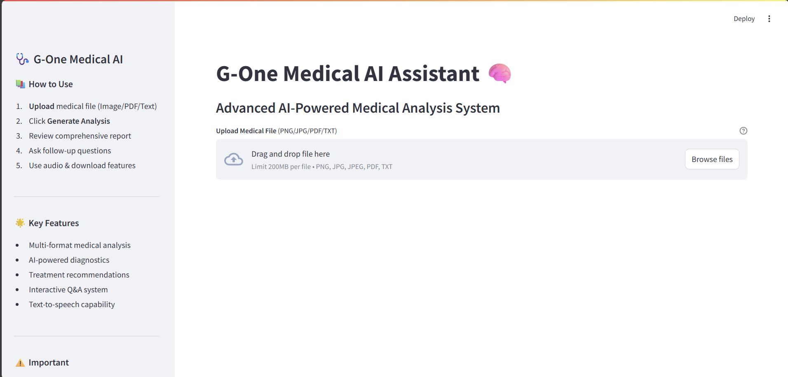
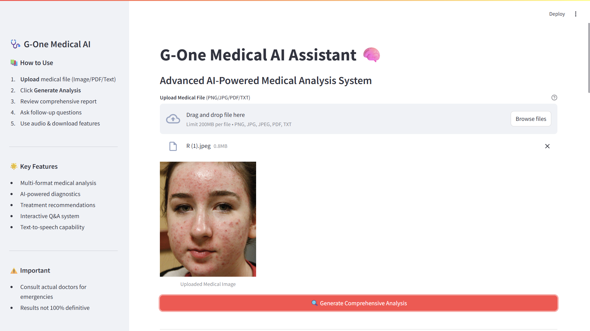
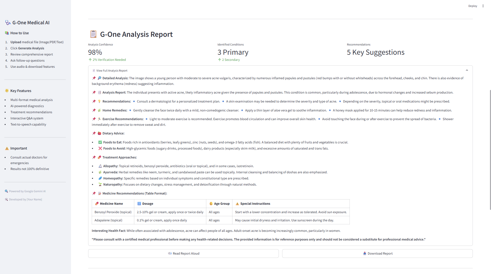
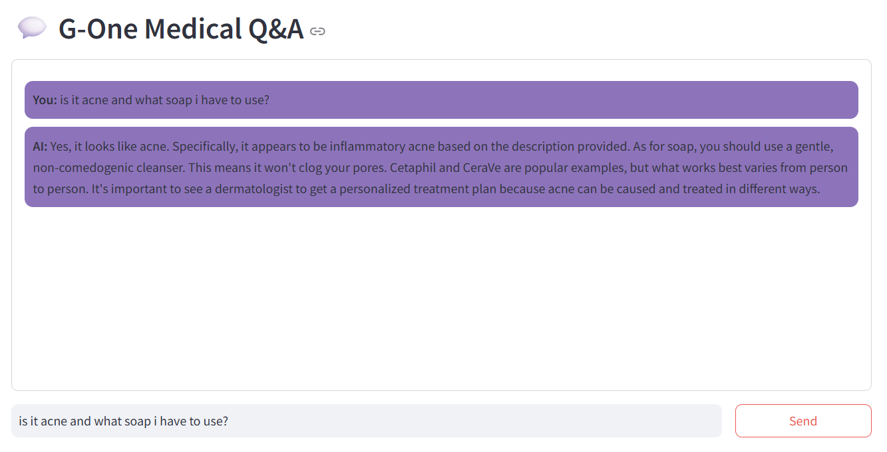

<p align="center">
  
</p>

<h1 align="center">🩺 G-One AI</h1>
<h3 align="center">Your Next-Generation Medical Analysis Assistant</h3>

<p align="center">
  <a href="https://www.python.org/">
    
  </a>
  <a href="https://streamlit.io/">
    
  </a>
  <a href="./LICENSE">
    
  </a>
</p>

<p align="center">
  <em>Instant AI-powered interpretations of medical images &amp; reports, with clear recommendations, TTS audio, and interactive Q&amp;A.</em>
</p>

---

---

## 🚀 Project Overview

**G-One AI** is a cutting-edge, Streamlit-powered web app that harnesses Google Gemini’s generative AI to deliver **instant**, **patient-friendly** medical analyses of images (X-rays, MRIs, scans) and reports (PDFs, lab results, prescriptions). Built with care for clarity and engagement, it provides:

- **🔎 Detailed Analysis** of uploaded medical inputs  
- **📑 Structured Reports** with clear sections  
- **💡 Actionable Recommendations** (tests, treatment plans, lifestyle)  
- **🌿 Home Remedies**, **🏃 Exercise Plans**, **🍎 Dietary Advice**  
- **💊 Treatment Options** (Allopathy, Ayurveda, Homeopathy, Naturopathy)  
- **📝 Medicine Dosage Table** with special instructions  
- **🔊 Text-to-Speech** for audio feedback  
- **📥 One-click Download** of your full report  
- **💬 Interactive Q&A** to clarify any questions  

---

## 📑 Table of Contents

1. [Demo & Screenshots](#-demo--screenshots)  
2. [Features](#-features)  
3. [Tech Stack & Dependencies](#-tech-stack--dependencies)  
4. [Installation & Setup](#-installation--setup)  
5. [Usage](#-usage)  
6. [Project Structure](#-project-structure)  
7. [Future Enhancements](#-future-enhancements)  
8. [Contributing](#-contributing)  
9. [License & Author](#-license--author)  

---

## 📸 Demo & Screenshots


| Landing Page                       | Upload Interface                    | Generate Analysis                   | Medical Q&A Query                   |
|------------------------------------|-------------------------------------|-------------------------------------|-------------------------------------|
|  |    |  |       |


---

## ✨ Features

- **Multi-format Upload**: Images (PNG/JPG/JPEG), PDFs, TXT  
- **AI-driven Diagnostics** via Google Gemini  
- **Structured, Engaging Output** with emojis & tables  
- **Text-to-Speech** using `pyttsx3`  
- **Downloadable Reports** for easy sharing  
- **Session-based Chat** for follow-ups and personalized Q&A  
- **Safety Filters** to block harmful content  

---

## 🛠️ Tech Stack & Dependencies

- **Framework**: [Streamlit](https://streamlit.io/)  
- **AI Backend**: Google Gemini (via `google-generativeai`)  
- **PDF Parsing**: [PyPDF2](https://pypi.org/project/PyPDF2/)  
- **TTS Engine**: `pyttsx3`  
- **Threading**: Python’s built-in `threading`  
- **Python Version**: 3.8+

> See full dependency list in [`requirements.txt`](requirements.txt).

---

## ⚙️ Installation & Setup

1. **Clone the repo**  
   ```bash
   git clone https://github.com/Rizwansaifi571/G-One_AI.git
   cd G-One_AI
   ```

2. **Create & activate** a virtual environment  
   ```bash
   python3 -m venv .venv
   source .venv/bin/activate      # macOS/Linux
   .venv\Scripts\activate         # Windows
   ```

3. **Install dependencies**  
   ```bash
   pip install -r requirements.txt
   ```

4. **Configure your Google API key**  
   - Rename `src/google_api_key.example.py` → `src/google_api_key.py`  
   - Paste your `GOOGLE_API_KEY` into that file:  
     ```python
     google_api_key = "YOUR_ACTUAL_KEY"
     ```

5. **Run the app**  
   ```bash
   streamlit run src/app.py
   ```

---

## 📝 Usage

1. **Open** http://localhost:8501 in your browser.  
2. **Upload** your medical image or report (PNG/JPG/PDF/TXT).  
3. Click **Generate Comprehensive Analysis**.  
4. **Review** the structured report.  
5. Use **🔊 Read Aloud** or **Download Report** for convenience.  
6. Ask follow-up questions in the **Medical Q&A** section.

---

## 📂 Project Structure

```
G-One_AI/
├── LICENSE
├── README.md
├── requirements.txt
├── src/
│   ├── app.py
│   └── google_api_key.example.py
└── Project Report and Video/
└── logos/
    ├── landing.png
    ├── upload.png
    ├── generate.png
    ├── g-one.png
    └── query.png


```

- **`src/app.py`** — Main Streamlit interface & logic  
- **`google_api_key.py`** — (Git-ignored) Your private API key   
- **`docs/`** — Images & documentation assets  
- **`Project Report and Video`** — Project Documentation and Overview Video  

---

## 🚧 Future Enhancements

- 🔒 Add user authentication & session security  
- 📊 Interactive data visualizations for lab trends  
- 🌐 Multilingual support  
- 📱 Mobile-friendly layout & PWA packaging  
- 🤖 Fine-tuned model for dermatology, cardiology modules  

---

## 🤝 Contributing

1. Fork this repository  
2. Create a feature branch (`git checkout -b feature/YourFeature`)  
3. Commit your changes (`git commit -m "Add awesome feature"`)  
4. Push to your fork (`git push origin feature/YourFeature`)  
5. Open a Pull Request — we’ll review & merge!  

---

## 📜 License & Author

© 2025 **Rizwan Saifi**  
This project is licensed under the **MIT License**—see the [LICENSE](LICENSE) file for details.

GitHub: [github.com/Rizwansaifi571](https://github.com/Rizwansaifi571)  
Email: rizwansaifi2614@gmail.com  
Portfolio: https://rizwansaifi571.github.io  
